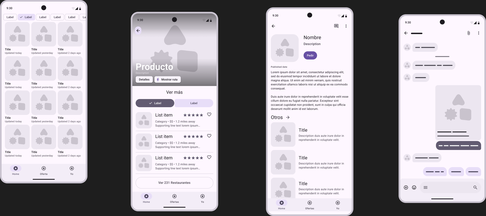
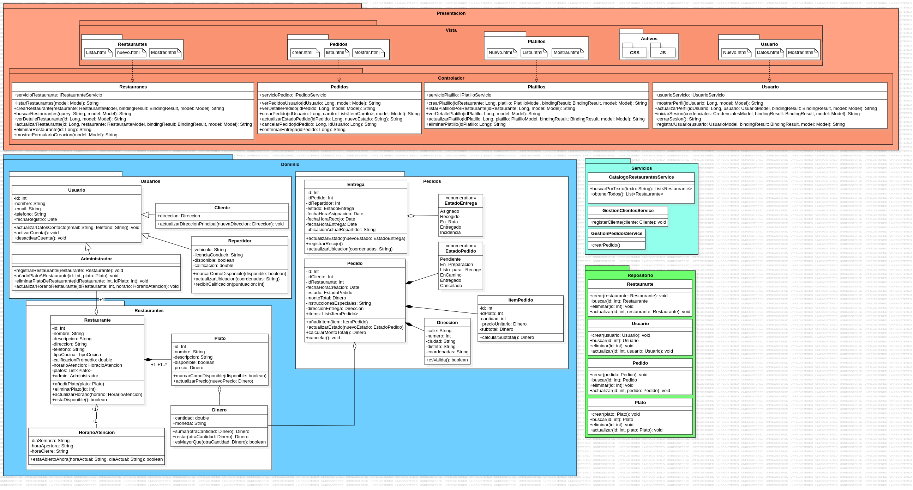
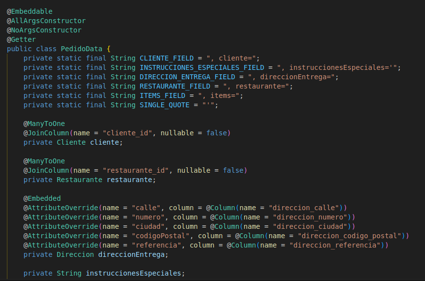
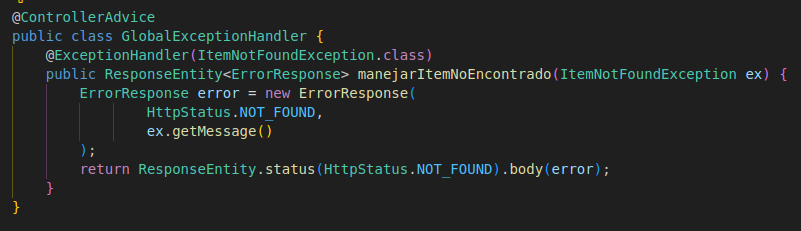
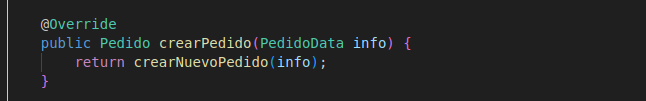
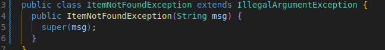
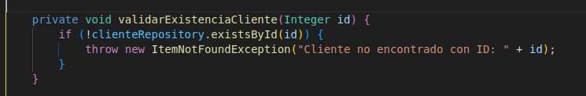
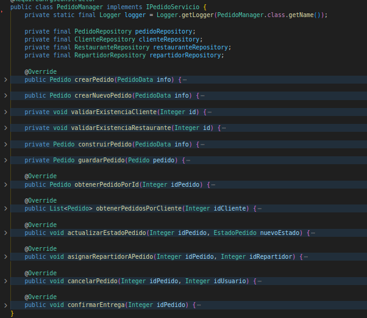
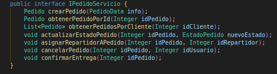

# SueldoMinimo App
+ Torres Ara Alberto Gabriel
+ Meza Pareja Arthur Patrick
+ Diaz Vasquez Esdras Amado
+ Rivera Cruz Diego Benjamin

### Propósito
---
Desarrollar una aplicación móvil que conecte a consumidores con negocios locales de comida en zonas urbanas y periurbanas de Arequipa, con el fin de mejorar el acceso a opciones alimenticias económicas y saludables, fortalecer la economía barrial y promover el empleo independiente mediante repartidores.

### Funcionalidades
---
#### Usuario
+ Activar su cuenta
+ Desactivar su cuenta
+ Actualizar datos personales
+ Puede ser Administrador, Repartidor, Cliente
#### Restaurante
+ Representa un negocio con platos y horarios
+ Actualizar horario `actualizarHorario()`
+ Verificar si está abierto `estaAbiertoAHora()`

+ Activar disponibilidad `estaDisponible()`

#### Pedido
+ Añadir ítems `addItem()`
+ Cambiar estado `actualizarEstado()`
+ Cancelar pedido `cancelar()`
+ Calcular total `calcularMontoTotal()`





# Laboratorio 11
## Nombres
+ Elija nombres que revelen su intención. Se combina las palabras `Pedido` + `Data` para expresar la información necesaria para crear un pedido.


## Comentarios
+ No añadas ruido obvio. Se eliminó comentarios que expresaban cambios o explicación de código.

→


## Funciones - Objetos/Estructura de Datos - Clases
+ Usa nombres descriptivos. 

+ Prefiere menos argumentos.


Se agrupa los atributos de la clase `Pedido` que se pasan como argumentos y se crea una nueva clase llamada `PedidoData` que contiene estos atributos.
+ Estructura de datos: Solo expone sus datos y no tienen funciones significativas.


Ahora en las funciones que necesitan crear pedidos se verá así:


+ Clases. `PedidoData` contiene los atributos de `Pedido`. Separa datos y lógica. Responsabilidad única.

## Tratamientos de Errores
+ Utiliza excepciones no verificadas (unchecked). Como RuntimeException

+ Prefiere Excepciones, no códigos de error:



# Laboratorio 12
## LSP (Liskov Substitution Principle)
`PedidoManager` implementa `IPedidoServicio`: Si intercambias esta implementación con otra que cumpla el contrato, el sistema sigue funcionando.



## SRP (Single Responsability Principle)
Se cumple porque cada clase tiene un propósito claro: `Pedido` representa la entidad con su lógica básica, y `PedidoData` agrupa los datos relacionados al pedido. Así, cada una tiene una única razón para cambiar.
```java
public class PedidoData {
  private Cliente cliente;
  private Restaurante restaurante;
  private Direccion direccionEntrega;
  private String instruccionesEspeciales;
  private List<ItemPedido> items = new ArrayList<>();
}
```
```java
public class Pedido {
  private static final Logger logger = Logger.getLogger(Pedido.class.getName());
  private PedidoData info;

  public Pedido() 
  public Pedido(PedidoData info, Integer idPedido)

  public void actualizarEstado(EstadoPedido nuevoEstado)
}
```

## DIP (Dependency Inversion Principle)
El controlador `PlatillosController` aplica correctamente el Principio de Inversión de Dependencias (DIP) al depender de la abstracción `IPlatilloServicio` en lugar de una implementación concreta.
```java
public class PlatillosController {
  private final IPlatilloServicio platilloServicio;

  public PlatillosController(IPlatilloServicio platilloServicio) {
      this.platilloServicio = platilloServicio;
  }
  // ...
}
```