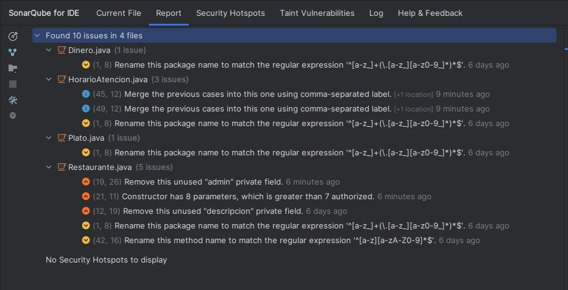

# Laboratorio 9
Referencias: https://www.oracle.com/technetwork/java/codeconventions-150003.pdf

## Reporte SonarLint


### `Dinero.java`
#### Indentación (Sección 4)
Se recomienda utilizar cuatro espacios para cada nivel de sangría en el código, en lugar de tabuladores, para mantener la legibilidad y consistencia en todos los entornos. Si se usan tabuladores, deben equivaler exactamente a 8 espacios.
```java
    public Dinero sumar(Dinero otraCantidad) {
        validarMoneda(otraCantidad);
        return new Dinero(this.cantidad.add(otraCantidad.cantidad).doubleValue(), moneda);
    }
```

#### Proporcionar acceso a variables de instancia y de clase (Sección 10.1)
No se deben declarar variables public sin una razón justificada. Lo ideal es que el acceso a las variables se haga mediante métodos getters y setters, para mantener la encapsulación, controlar el acceso y proteger el estado interno del objeto.
```java
    private final BigDecimal cantidad;
    private final String moneda;
    
    public BigDecimal getCantidad() {
        return cantidad;
    }

    public String getMoneda() {
        return moneda;
    }
```

#### Returning Values (Sección 10.5.2)
Al devolver valores, se recomienda evitar estructuras innecesarias como if/else redundantes. Siempre que sea posible, utiliza retornos directos o expresiones ternarias para simplificar y reflejar claramente la intención del método.
```java
    public boolean esMayorQue(Dinero otraCantidad) {
        validarMoneda(otraCantidad);
        return this.cantidad.compareTo(otraCantidad.cantidad) > 0;
    }
```

#### Constantes (Sección 10.3)
Evita escribir valores numéricos directamente en el código ("números mágicos"). En su lugar, utiliza constantes con nombres descriptivos, declaradas como static final. Solo se permite el uso directo de -1, 0 y 1 en contextos como bucles for.
```java
private final BigDecimal cantidad;
```

#### Convenciones de nomenclatura (Sección 9)
Nombres claros, con estilo CamelCase para clases y lowerCamelCase para métodos.
```java
public class Dinero {
    public Dinero sumar(Dinero otraCantidad) { ... }
    public boolean esMayorQue(Dinero otraCantidad) { ... }
}
```

### `HorarioAtencion.java`
#### Comentarios (Sección 5)
Los comentarios deben añadir valor y no duplicar lo evidente. Deben ser claros, actualizados y evitar la redundancia para no quedar obsoletos.
```java
    // Convierte un nombre de día en español a DayOfWeek
    private DayOfWeek parseDia(String dia) {
        switch (dia.toLowerCase(Locale.ROOT)) {
            case "lunes": return DayOfWeek.MONDAY;
            case "martes": return DayOfWeek.TUESDAY;
            case "miercoles": return DayOfWeek.WEDNESDAY;
            case "jueves": return DayOfWeek.THURSDAY;
            case "viernes": return DayOfWeek.FRIDAY;
            case "sabado": return DayOfWeek.SATURDAY;
            case "domingo": return DayOfWeek.SUNDAY;
            default: throw new IllegalArgumentException("Día inválido: " + dia);
        }
    }
```

### `Restaurante`
#### Java Source Files (Sección 3.1)
Cada archivo .java debe contener una sola clase o interfaz pública, y debe estar ubicada al inicio del archivo. Si hay clases privadas auxiliares, pueden colocarse después de la clase pública principal.
```java
package Model.Dominio.Restaurantes;

public class Restaurante {
    ...
}
```

#### Placement (Sección 6.2)
Las variables de instancia están declaradas al inicio del bloque de clase, como lo indica la convención.
```java
private final int id;
private String nombre;
private String descripcion;
private String direccion;
private String telefono;
private TipoCocina tipoCocina;
private double calificacionPromedio;
private HorarioAtencion horarioAtencion;
private List<Plato> platos;
private Administrador admin;
```

# Laboratorio 10 - Estilos de Programación
## Estilos usados
### Pipeline
La clase `HomeController` aplica el estilo de programación Pipeline al estructurar su lógica como una 
secuencia clara de etapas: primero obtiene los datos (`obtenerRestaurantes()`), luego los transforma 
agregándolos al modelo (`prepararModelo(...)`), y finalmente entrega una salida 
(vistaHome()) que representa la vista a renderizar.
```java
public class HomeController {
    public String home(Model model) {
        List<Restaurante> restaurantes = obtenerRestaurantes();
        prepararModelo(model, restaurantes);
        return vistaHome();
    }

    private List<Restaurante> obtenerRestaurantes() {
        // ...
    }

    private void prepararModelo(Model model, List<Restaurante> restaurantes) {
        // ...
    }

    private String vistaHome() {
        // ...
    }
}
```
### Code golf
El estilo Code Golf se basa en escribir el menor número posible de líneas o caracteres de código para 
lograr una funcionalidad. En la función `buscarPorTexto`, este estilo se ve reflejado en varios aspectos: 
toda la lógica está contenida en una única expresión fluida, que encadena la obtención de datos, 
el filtrado y la conversión final a lista. No hay variables intermedias ni pasos separados: el método 
directamente retorna el resultado final, minimizando el tamaño del código. 
Además, el uso de expresiones lambda `(r -> ...)` y el método `.toList()` en la misma línea muestra cómo 
el estilo Code Golf favorece la concisión funcional y evita bloques estructurados innecesarios.
```java
public List<Restaurante> buscarPorTexto(String texto) {
    return restauranteRepo
            .obtenerTodos()
            .stream()
            .filter(r -> contiene(r.getNombre(), texto) || contiene(r.getDescripcion(), texto))
            .toList();
}
```
### Error/Exception Handling
La función `verDetalle` aplica el estilo de programación Error/Exception Handling, 
que se enfoca en separar claramente el flujo normal del flujo erróneo mediante el uso de 
excepciones. En este caso, el intento de obtener un restaurante por su ID se 
encapsula dentro de un bloque try, lo que indica que la operación puede fallar.
```java
    @GetMapping("/{id}")
    public String verDetalle(@PathVariable Long id, Model model) {
        try {
            Restaurante restaurante = restauranteServicio.buscarPorId(id);
            model.addAttribute("restaurante", restaurante);
            return "restaurante";
        } catch (Exception e) {
            model.addAttribute("error", e.getMessage());
            return "error";
        }
    }
```
### RESTful
Las funciones que se mostraron en las secciones anteriores usan los tags @PostMapping, @PutMapping, @DeleteMapping, @GetMapping. 
Aplican el estilo de programación RESTful al seguir los principios del diseño de APIs REST: usar los métodos 
HTTP estándar para representar operaciones sobre recursos.

## Mejora de la calidad del código y correción de "Code Smells"
### Evitar retornar constantes directamente desde métodos
Se reemplazó el valor literal retornado por una constante estática de clase, lo que mejora la mantenibilidad y evita el olor a código "Methods should not return constants".
```java
static final String HOME_URL = "home";

private String vistaHome() {
    return HOME_URL;
}
```
Esto permite centralizar el valor, facilitando cambios futuros y evitando la repetición de literales.

### Sustituir la inyección de dependencias por campo
En lugar de usar inyección por atributo (field injection), se refactorizó la clase para usar inyección por constructor. Esto mejora la legibilidad, permite pruebas más sencillas y cumple con el principio de inversión de dependencias.
```java
    private CatalogoRestaurantesService catalogoRestaurantesService;
    
    @Autowired
    public HomeController(CatalogoRestaurantesService catalogoRestaurantesService) {
        this.catalogoRestaurantesService = catalogoRestaurantesService;    
    }
```
Inyección por constructor es más segura y evita problemas de dependencia no inicializada.

### Evitar el uso de excepciones genéricas
En lugar de lanzar o propagar una excepción genérica (Exception o RuntimeException), se capturó el error y se devolvió un mensaje de resultado claro a la interfaz web. Esto evita el olor a código "Generic exceptions should never be thrown", y mejora la experiencia del usuario final.
```java
@DeleteMapping("/{id}")
@ResponseBody
public String eliminarRestaurante(@PathVariable Long id) {
    try {
        restauranteServicio.eliminar(id);
        return "Restaurante eliminado correctamente";
    } catch (Exception e) {
        return "No se pudo eliminar el restaurante: " + e.getMessage();
    }
}
```
Se evita lanzar excepciones innecesarias y se ofrece un resultado más controlado y útil para el cliente HTTP.